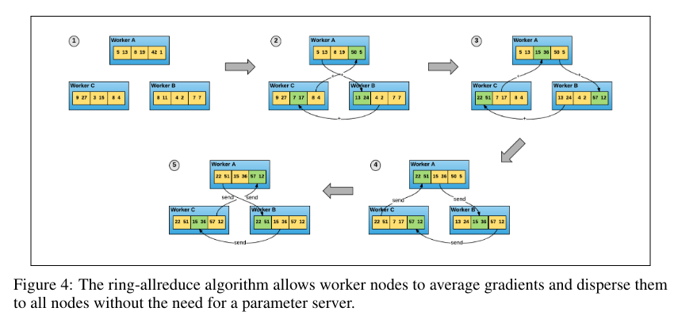
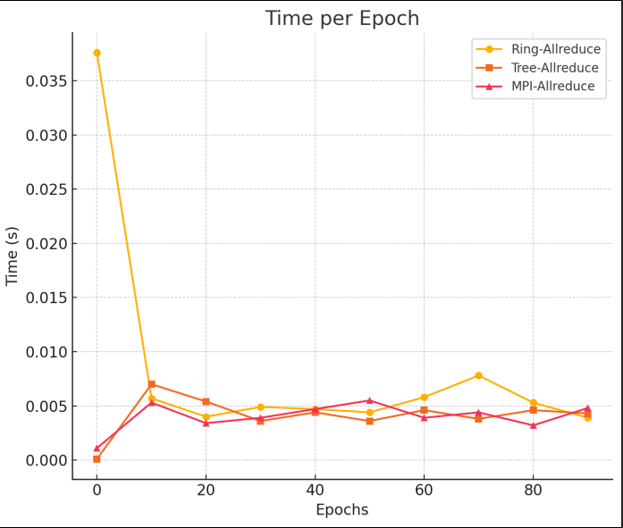

# Project report

Name: Jérémy Doiron

## Introduction

This project aims to implement and benchmark different distributed gradient descent algorithms using MPI. It is inspired by the following paper published by Uber: [Horovod: fast and easy distributed deep learning in
TensorFlow](https://arxiv.org/pdf/1802.05799).

## Analysis

As deep learning continues to advance, the need for distributed computing has become increasingly important. There is a need to train large datasets within short timeframes. As illustrated in the article, training GPUs with the current models used less than half of the available resources. This is what motivated the development of Horovod. Distributed training requires to split up the dataset and training on multiple nodes. For synchronous gradient descent (SGD), each node computes the gradient locally and then averages them to update the model on each node. The article summarize this process as follows:

1. Run multiple copies of the training script and each copy:  
    (a) reads a chunk of the data  
    (b) runs it through the model  
    (c) computes model updates (gradients)  
2. Average gradients among those multiple copies
3. Update the model
4. Repeat (from Step 1a)

In early 2017, Baidu drafted an implementation of an algorithm for averaging gradients called ring-allreduce. It is said to be network-optimal, and it is what Horovod is based on. The following image shows the ring-allreduce algorithm:

## Implementation

Using MPI, the code found in `sgd.py` implements different distributed training algorithms. First, MPI is initialized. Then, the model is defined along with the parameters and the dataset. The equivalent of 1c can be found in the `compute_gradient` function. Finally, there is the training loop which calls the various algorithms and updates the model. This simple script allows us to benchmark and compare such algorithms. I implemented the following:

- `ring_allreduce`: Gradients are communicated in a cyclic manner. Horovod, named after a
traditional Russian folk dance in which performers dance with linked arms in a circle, is based upon this idea.
- `tree_allreduce`: Uses a binary tree-based pattern to synchronize gradients.
- `mpi_allreduce`: Utilizes the built-in MPI.Allreduce for efficient gradient aggregation. It uses different algorithms depending such as ring-allreduce, tree-allreduce and much more.

## Benchmarks

The following benchmarks were performed on a single node with 8 cores on Grid'5000. The output can be found in `output.txt`.

Runtime Efficiency:

    Average Times:  
      - ring_allreduce: 0.0048s/epoch
      - tree_allreduce: 0.0041s/epoch
      - mpi_allreduce: 0.0046s/epoch
  
tree_allreduce performs slightly better on average, but all methods are close in runtime. However, the difference is not significant. I believe there is a big gap between the all reduce algorithms and the others. When comparing the presented algorigthms it simply comes out as a matter of optimization with the number of nodes and the hardware.

The following graph shows the time taken to compute the gradients for each epoch of each algorithm:

## Conclusion

This project was a great opportunity to learn about distributed computing and the different distributed training algorithms. I learned a lot about the implementation of Horovod and how it functions.
